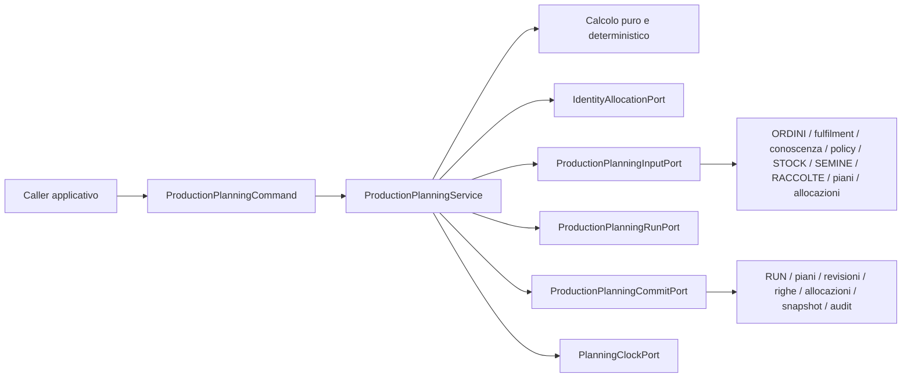

# Production Planning Engine Application Freeze V1

**Stato:** READY FOR REVIEW

## 1. Autorità e perimetro

Questo documento congela esclusivamente il contratto applicativo provider-neutral del Production Planning Engine V1. È subordinato a:

- `PRODUCTION_PLANNING_ENGINE_FREEZE.md`;
- `PRODUCTION_PLANNING_POSTGRESQL_PHYSICAL_SCHEMA_FREEZE.md`;
- `POSTGRESQL_PHYSICAL_SCHEMA.md`;
- `ORDINI.md`;
- `STOCK.md`.

Non introduce authority, schema persistente, enum, API, UI o writer ulteriori. I nomi PostgreSQL sono richiamati soltanto per rendere verificabile la corrispondenza con le authority già congelate. Google Sheets e il Write Plan legacy non appartengono al runtime autorevole.

Il bounded context Production Planning:

- legge domanda commerciale residua, conoscenza produttiva approvata, policy, STOCK, SEMINE, RACCOLTE, piani e allocazioni;
- calcola un piano deterministico e completo;
- persiste RUN, piano, revisione, righe, risorse, allocazioni, snapshot di ripianificazione, messaggi e audit mediante i writer già congelati;
- non modifica ORDINI, RIGHE_ORDINE, CONSEGNE, STOCK, SEMINE, RACCOLTE o MOVIMENTI_MAGAZZINO;
- non trasforma una previsione in fatto fisico.

Il Pure Planning Engine, il Commit Assembler, il Commit Writer e
l'Orchestrator hanno responsabilita separate secondo il boundary congelato al
§7.1. Il termine "motore" non autorizza uno di questi componenti ad assumere le
responsabilita degli altri.

## 2. Command pubblico provider-neutral

Il solo ingresso pubblico è il valore immutabile `ProductionPlanningCommand`, una somma chiusa di due forme strutturali, non un nuovo enum:

```text
ProductionPlanningCommand =
    InitialProductionPlanningCommand
    | ReplanProductionPlanningCommand
```

### 2.1 InitialProductionPlanningCommand

| Campo | Contratto |
|---|---|
| `business_at` | istante timezone-aware che congela la vista temporale e la policy applicabile |
| `policy_set_code` | codice non vuoto del Planning Policy Set già commissionato |
| `policy_version` | versione positiva richiesta; nessuna selezione implicita della “più recente” |
| `actor_id` | actor esplicito, non vuoto |
| `reason` | motivazione esplicita, non vuota e sanitizzabile |
| `correlation_id` | correlazione esplicita, non vuota, non usata nell’idempotency hash |

### 2.2 ReplanProductionPlanningCommand

Contiene tutti i campi del command iniziale e inoltre:

| Campo | Contratto |
|---|---|
| `previous_revision_public_id` | revisione corrente completa da sostituire |
| `order_line_public_id` | RIGA_ORDINE che causa la richiesta |
| `replanning_reason_code` | uno dei valori del frozen `replanning_reason_code`; nessun valore applicativo aggiuntivo |

Il command non contiene PK PostgreSQL, nomi tabella, Connection, transaction, SQL, payload Google, ID generati dal provider o dati produttivi copiati dal caller. Non consente al caller di dichiarare quantità consegnata, STOCK disponibile, protocollo, date calcolate, allocazioni o outcome.

L’assenza di uno scope di domanda nel command è intenzionale: l’insieme eleggibile è letto dall’authority nel `business_at`, non scelto dal caller. Gli identificativi pubblici necessari alla RUN e al piano sono allocati dall’applicazione mediante la Identity già esistente.

## 3. Input contract

### 3.1 Regole generali

Tutti gli input letti dalle port sono snapshot immutabili, provider-neutral e ordinati deterministicamente. Quantità e coefficienti usano decimali esatti; mai binary floating point. Gli istanti sono timezone-aware; le date restano date. Le unità non sono convertite implicitamente. Ogni aggregate mutabile porta la propria optimistic version.

Gli snapshot non sono nuove authority: sono rappresentazioni applicative temporanee delle authority congelate.

### 3.2 PlanningInputSnapshot

`PlanningInputSnapshot` contiene:

- policy esatta richiesta;
- tutte le domande eleggibili;
- protocolli/versioni approvati candidati;
- disponibilità STOCK eleggibile;
- produzione in corso eleggibile da SEMINE;
- RACCOLTE effettive eleggibili;
- allocazioni materialmente rilevanti;
- piani e revisioni correnti materialmente rilevanti;
- per il replanning, lo snapshot canonico completo richiesto dal Freeze.

Ogni lettura è riferita allo stesso `business_at`. Il provider deve impedire una composizione silenziosa di snapshot provenienti da istanti logici diversi.

### 3.3 DemandSnapshot

Per ogni RIGA_ORDINE eleggibile:

- public ID ORDINE e RIGA_ORDINE;
- versioni ORDINE e RIGA_ORDINE;
- stato ORDINE;
- VARIETÀ e UOM;
- quantità ordinata;
- quantità netta consegnata derivata esclusivamente dalle RIGHE_CONSEGNA di CONSEGNE `CONSEGNATA`;
- domanda residua commerciale;
- data ORDINE, data prevista disponibile e priorità commerciale congelata;
- provenance necessaria già presente nell’authority.

Sono eleggibili soltanto ORDINI `APERTO` o `PARZIALMENTE_EVASO` con residuo positivo. `PROGRAMMATA`, `IN_PREPARAZIONE` e `ANNULLATA` contribuiscono zero al consegnato. STOCK, RACCOLTE, MOVIMENTI_MAGAZZINO, audit e allocazioni non sono fonti alternative del fulfilment.

### 3.4 ProductionKnowledgeSnapshot

Per ogni protocollo candidato:

- public ID e versioni strutturali;
- VARIETÀ;
- `approval_state`, con esclusivamente i valori già congelati `BOZZA`,
  `APPROVATA`, `RITIRATA`;
- intervallo di validità;
- durata fasi, resa, granularità, quantità seme e altre risorse congelate;
- readiness e dati necessari al backplanning.

Il motore usa una sola versione approvata, completa e valida. Assenza, ambiguità, sovrapposizione o incompletezza sono fail-closed; `contenuto` legacy non è authority Planning.

Lo snapshot rappresenta fedelmente anche versioni `BOZZA` e `RITIRATA`; il
modello non le filtra. La selezione delle sole versioni `APPROVATA` appartiene al
Planning Engine.

### 3.5 PlanningPolicySnapshot

Contiene field-by-field: `reference` (`policy_set_code`, `version`), `valid_from`, `valid_to`, `quantitative_buffer_type`, `quantitative_buffer_value`, `priority_policy_code`, `algorithm_version` e `harvest_target_strategy`. La versione deve essere valida al `business_at`; nessun default applicativo sostituisce un dato mancante.

Il vocabulary V1 è chiuso: `priority_policy_code = DELIVERY_THEN_PUBLIC_ID`, `algorithm_version = production-planning-v1` e `harvest_target_strategy = EARLIEST_APPROVED_WINDOW`. Valori differenti falliscono chiuso. `planning_algorithm_version` identifica l'algoritmo Planning e non deriva dalla versione del canonical encoding, anche quando il testo coincide.

Timezone appartiene esclusivamente all'autorità temporale globale TPO (`OFFICIAL_TIMEZONE_NAME` / `OFFICIAL_TIMEZONE`, `Atlantic/Canary`). Il cutoff non è un input autorevole V1. Buffer temporale e granularità appartengono alla versione protocollo. Readiness appartiene agli snapshot autorevoli di STOCK, SEMINA, RACCOLTA, allocazioni rilevanti e protocollo quando previsto.

### 3.6 Resource snapshots

`StockResourceSnapshot` contiene public ID risorsa/VARIETÀ, quantità disponibile, UOM, quantità già allocata materialmente rilevante e version. In V1 una riga STOCK con residuo allocabile positivo è già fisicamente disponibile: non esiste un distinto `readiness_code` live. Lo STOCK resta fotografia corrente: leggere o allocare non ne modifica la quantità.

`InProgressResourceSnapshot` contiene public ID SEMINA, VARIETÀ, protocol version, finestra produttiva, quantità utile attesa, quantità già allocata e semina version. Quantità utile, relativa UOM e finestra sono authority persistite su SEMINA; l'Input Adapter deriva soltanto i saldi di allocazione e non applica formule biologiche o temporali. Una SEMINA non commissionata non è una risorsa eleggibile.

`HarvestResourceSnapshot` contiene il fatto RACCOLTA effettivo, la quantità eleggibile e la provenance già congelata. Una previsione di raccolta non può essere trattata come fatto RACCOLTA.

`ActiveAllocationSnapshot` contiene public ID, frozen `allocation_type`, source
public ID, destination order-line public ID, UOM, `allocated_quantity`,
`consumed_quantity`, `released_quantity`, `transferred_quantity`,
`invalidated_quantity`, `remaining_quantity`, frozen state e version. Il saldo
è derivato dai fatti append-only; il modello non introduce una seconda authority.

### 3.7 ReplanningInputSnapshot

Il replanning include, nell’ordine e nel framing canonico congelati:

- revisione precedente e RIGA_ORDINE;
- reason code;
- quantità ordinata, consegnata e residua;
- versioni autorevoli;
- protocollo e validità;
- Planning Policy Set Version;
- buffer e dati temporali congelati;
- STOCK materialmente rilevante, ordinato deterministicamente;
- SEMINE materialmente rilevanti, ordinate deterministicamente;
- allocazioni materialmente rilevanti, ordinate per allocation public ID, con
  allocated, consumed, released, transferred, invalidated, remaining, stato e
  versione derivati dai fatti autorevoli;
- ogni altro elemento esplicitamente incluso dal canonical encoding frozen.

RUN, timestamp tecnico, caller, actor e correlation ID non entrano nella chiave di replanning.
Il canonical encoding include tutti i saldi sopra elencati, con Decimal
canonici e framing deterministico; non ricostruisce saldi da uno stato terminale.

## 4. Output contract

Il successo certo restituisce l’immutabile `ProductionPlanningResult`, che
rappresenta esclusivamente una RUN `COMMITTED`:

| Campo | Contratto |
|---|---|
| `planning_run_public_id` | public ID `RPP-*` |
| `run_state` | valore frozen `COMMITTED` |
| `plan_public_ids` | public ID dei piani interessati, ordinati |
| `current_revision_public_ids` | revisioni complete risultanti, nello stesso ordine dei piani |
| `revision_results` | una `RevisionCommitResult` per ogni revisione risultante, ordinata per plan public ID e revision public ID |
| `planning_line_public_ids` | righe prodotte, ordinate secondo il risultato deterministico |
| `allocation_public_ids` | allocazioni create, ordinate |
| `committed_at` | istante di conclusione autorevole |
| `warnings` | messaggi provider-neutral sanitizzati e ordinati |

`RevisionCommitResult` associa univocamente `plan_public_id`, `revision_public_id`,
`revision_request_key`, una e una sola fra `planning_key_v1` e
`replanning_key_v1`, e `reused_existing_revision`. La forma initial/replanning è
strutturale e non introduce un enum. `revision_request_key` coincide con la
chiave strutturale applicabile. I campi singoli globali `planning_key_v1`,
`replanning_key_v1` e `reused_existing_revision` non appartengono più a
`ProductionPlanningResult`.

Un replay idempotente viene valutato per ogni `revision_request_key`: ogni
revisione compatibile può essere riusata, conservando nel risultato la propria
associazione piano/revisione/chiave e il proprio indicatore di riuso. Un mismatch
materiale resta un conflitto e nessuna revisione rappresenta arbitrariamente
l'intero commit. Il replay non crea una nuova revisione e non promette il riuso
del public ID di una RUN nuova aperta per osservarlo.

Le failure certe sono espresse tramite `ProductionPlanningError` e una categoria
frozen. Un esito fisico non determinabile è espresso dall'immutabile e distinto
`ProductionPlanningReconciliationRequiredResult`, contenente esclusivamente:

- `planning_run_public_id`;
- `run_state = RECONCILIATION_REQUIRED`;
- `business_at` e `observed_at`, entrambi timezone-aware;
- `correlation_id` del command;
- `failure_category = RECONCILIATION_REQUIRED`;
- codice e messaggio provider-neutral sanitizzati.

Il risultato incerto non contiene né richiede public ID di piani, revisioni o
righe committed, `RevisionCommitResult`, flag created/reused o `committed_at`.
Non dichiara rollback, commit, failure certa o retryability. Il return type
pubblico è la union chiusa provider-neutral:

```text
ProductionPlanningRunOutcome =
    ProductionPlanningResult
    | ProductionPlanningReconciliationRequiredResult
```

L’output non espone PK, SQLSTATE, SQL, stack trace, DSN, secret, dettagli driver o nomi fisici.

## 5. Application models

I modelli applicativi obbligatori sono:

- `ProductionPlanningCommand`, con le due forme strutturali definite al §2;
- `PlanningExecutionContext`: actor, reason e correlation ID espliciti;
- `PolicyVersionReference`: set code e versione;
- `PlanningInputSnapshot` e gli snapshot del §3;
- `CanonicalPlanningRequest`: valori normalizzati e ordinati destinati a `planning_key_v1`;
- `CanonicalReplanningSnapshot`: valori e collezioni nel framing frozen destinati a `canonical_hash` e `replanning_key_v1`;
- `PlanningCandidate`: calcolo non persistito con domanda, timeline, quantità e provenance;
- `PlanRevisionDraft`: revisione completa, non un delta;
- `PlanningLineDraft`: timeline, target, quantità produttiva, stato frozen e planning key scope;
- `SeedResourceDraft`: quantità seme e UOM derivati dal protocollo;
- `AllocationDraft`: parent e child tipizzato coerente con il frozen `allocation_type`;
- `AllocationTransitionDraft`: transizione quantitativa provider-neutral già determinata;
- `RunMessage`: tipo già frozen, eventuale failure category frozen, codice, messaggio e posizione;
- `ProductionPlanningCommit`: write set completo e deterministico;
- `RevisionCommitResult`: esito idempotente univoco di una singola revisione;
- `ProductionPlanningResult`, risultato esclusivamente `COMMITTED`;
- `ProductionPlanningReconciliationRequiredResult`, risultato esclusivamente
  `RECONCILIATION_REQUIRED` senza dati committed dedotti;
- `ProductionPlanningRunOutcome`, union chiusa dei due risultati pubblici;
- `ProductionPlanningError`.

Public ID, date, istanti, quantità, unità, versioni e hash sono value object validati. I modelli non replicano entità ORM né ammettono dizionari/provider payload come contratto pubblico.

## 6. Ports richieste

### 6.1 IdentityAllocationPort

Alloca, tramite l’Identity persistente già congelata, i public ID necessari per RUN, piani, revisioni, righe, snapshot e allocazioni. Le allocazioni avvengono in transazioni brevi separate, in ordine lessicografico di sequence name, mai mentre sono detenuti business lock.

### 6.2 ProductionPlanningInputPort

Legge una sola volta un `ProductionPlanningLoadedInput` immutabile e
provider-neutral, composto dallo snapshot coerente e completo delle authority
elencate al §3 e dalle `allocation_disposition_decisions`. Nell'initial planning
la collezione disposition è vuota; nel replanning è autorevole, completa, unica
e ordinata per allocation public ID. Il Service non deduce disposition. La port
non filtra tramite euristiche provider-specifiche e non inventa default. Espone
versioni e provenance necessarie alla revalidation.

### 6.3 ProductionPlanningRunPort

Apre la RUN `OPEN`, registra i dati frozen e la expected version; finalizza una
failure certa con CAS in transazione separata; supporta la riconciliazione
esclusivamente secondo il protocollo già congelato e restituisce
`ProductionPlanningReconciliationRequiredResult`. Non completa autonomamente
una RUN committed fuori dal commit autorevole e non sintetizza dati committed
durante la riconciliazione.

### 6.4 ProductionPlanningCommitPort

È l’unico writer autorevole del piano. Riceve il write set completo, acquisisce i lock, rilegge e revalida le authority, applica optimistic concurrency e committa atomicamente piano, revisione, righe, risorse, allocazioni, snapshot, messaggi, audit e conclusione RUN.

Non modifica le authority di input e non esegue I/O esterno durante i lock.

### 6.5 PlanningClockPort

Fornisce soltanto istanti tecnici di apertura/completamento. `business_at` proviene dal command e non viene sostituito dal clock.

Non sono richieste port Google, API, UI, event bus, stock writer, order writer, delivery writer, semina writer o harvest writer.

### 6.5-bis ProductionPlanningCommitAssembler

`ProductionPlanningCommitAssembler` e un componente applicativo esplicito,
immutabile rispetto agli input, provider-neutral e deterministico. Non e una
port infrastrutturale e non effettua I/O. Riceve:

- il `ProductionPlanningCommand` validato;
- la `ProductionPlanningRunSnapshot` gia aperta;
- il `PlanningInputSnapshot` autorevole completo;
- la collezione ordinata di `PlanningCandidate` prodotta dal Pure Planning
  Engine;
- gli identificativi pubblici gia allocati tramite `IdentityAllocationPort`,
  in un bundle tipizzato e ordinato.

Il boundary obbligatorio è:

```text
PURE ASSEMBLY PLAN
→ IDENTITY ALLOCATION
→ PURE MATERIALIZATION
```

`plan(ProductionPlanningAssemblyInput) -> ProductionPlanningAssemblyPlan`
esegue una sola volta coverage, resource selection, deficit, buffer,
granularity, replanning, cardinalità seed, ordering, contatori, messaggi, audit
intent e discovery degli identity slot. Il piano è immutabile, provider-neutral,
non contiene public ID allocati, provider object o persistence e congela tutte
le decisioni definitive necessarie alla materializzazione.

Ogni `ProductionPlanningIdentitySlot` contiene `sequence_name`, `slot_kind`,
`canonical_slot_key` normalizzata e `position`. Gli slot sono unici e ordinati
prima per sequence name lessicografico e poi per canonical slot order. Il
Service invoca `IdentityAllocationPort.allocate(sequence_name)` esattamente una
volta per slot, senza retry. `ProductionPlanningIdentityBundle` mappa
esattamente slot a public ID e rifiuta slot mancanti/eccedenti, ordine errato,
ID duplicati e prefix incompatibili.

`materialize(assembly_plan, identity_bundle) -> ProductionPlanningCommit`
verifica la corrispondenza slot/bundle, assegna gli ID e costruisce draft, chiavi
ID-dependent e audit finali. Non ricalcola coverage, resource selection,
deficit, ordering o altre decisioni business. `assemble()` è ammesso soltanto
come wrapper compatibile `plan() → materialize()` e non mantiene un algoritmo
parallelo. Non sono ammessi `dict`, payload SQL/provider o callback opachi come
boundary. L'Assembler non alloca Identity, non genera UUID casuali e non
effettua letture aggiuntive.

### 6.6 AllocationTransitionDraft e commit

`AllocationTransitionDraft` è immutabile e contiene:

- `allocation_public_id` ed `expected_version` non negativa;
- `current_state`, obbligatoriamente `ATTIVA`, e `target_state` frozen;
- i saldi snapshot-derived `observed_allocated_quantity`,
  `observed_consumed_quantity`, `observed_released_quantity`,
  `observed_transferred_quantity`, `observed_invalidated_quantity` e
  `observed_remaining_quantity`;
- `consumed_quantity_delta`, `released_quantity_delta`,
  `transferred_quantity_delta`, `invalidated_quantity_delta`, Decimal esatti
  nella UOM osservata;
- `replacement_allocation_public_id`, obbligatorio esclusivamente quando il
  delta trasferito è positivo;
- `reason` e `provenance` non vuoti e sanitizzati.

Almeno un delta è positivo, nessun delta è negativo e release, transfer e
invalidation sono mutuamente esclusivi. Il target deve essere la conseguenza
esplicita dei saldi risultanti: `ATTIVA` se resta residuo, altrimenti
`CONSUMATA`, `RILASCIATA`, `SOSTITUITA` o `INVALIDA` secondo l'unica conclusione
ammessa. Il writer non sceglie quantità, replacement o target.

I saldi observed sono derivati dall'`ActiveAllocationSnapshot` della stessa
allocation e della stessa `expected_version`; non costituiscono authority.
Devono essere Decimal esatti, non negativi, con allocated positivo e soddisfare:

```text
observed_remaining = observed_allocated - observed_consumed
                     - observed_released - observed_transferred
                     - observed_invalidated
expected_remaining_after = observed_remaining - somma(delta)
```

La somma dei delta non supera il residuo observed. Se il residuo risultante è
positivo il target è `ATTIVA`; a zero è `CONSUMATA` soltanto quando il consumo
totale finale coincide con allocated, altrimenti la disposizione positiva
determina rispettivamente `RILASCIATA`, `SOSTITUITA` o `INVALIDA`. Il writer
rilegge e ricalcola sotto lock tutti i saldi e la version; ogni mismatch produce
concurrency/allocation conflict.

I saldi observed costituiscono il before payload applicativo; saldi e delta
determinano senza inferenze l'after payload. L'audit resta non-authoritative.

`ProductionPlanningCommit` trasporta `allocation_transitions` ordinata per
allocation public ID e univoca per parent. Nuove `AllocationDraft` e transizioni
di allocazioni esistenti restano collezioni distinte. Ogni `AuditDraft`
immutabile e provider-neutral contiene `entity_type`, `entity_public_id`,
operation frozen, before/after canonici e una provenance specifica obbligatoria,
normalizzata e non vuota. L'adapter non inventa né deduce provenance o payload
business.

Per tutti gli audit dello stesso commit, actor, reason e correlation ID
provengono esclusivamente da `ProductionPlanningCommit.context` e non sono
duplicati nei singoli `AuditDraft`. `occurred_at` proviene dal singolo persistence
timestamp tecnico del writer. Il writer combina `AuditDraft`, execution context
e persistence timestamp senza interpretare i business payload.

`expected_version` è l'epoch idempotente del batch per il parent. Un replay
rilegge tutte le transizioni della coppia allocation/version e confronta
integralmente l'insieme canonico ordinato di tipo, quantità, replacement, reason
e provenance. Payload identico è riuso compatibile; qualunque differenza è
conflict. Questo boundary non dipende dalla contemporaneità: due richieste già
in-flight sullo stesso parent ed epoch con identico payload canonico ricevono
entrambe il risultato committed compatibile, applicando una sola mutazione
fisica. La distinzione temporale tra replay successivo e duplicate concorrente
non è authority V1 e non viene dedotta. Lo stesso epoch con payload differente è
`ALLOCATION_CONFLICT`; una expected version stale senza batch committed
compatibile resta concurrency/allocation conflict secondo la causa frozen.
`ON CONFLICT DO NOTHING` non prova idempotenza.

Sotto lock per allocation public ID crescente il writer verifica stato
`ATTIVA`, expected version, fatti esistenti e residuo, valida il batch, inserisce
i fatti, aggiorna stato/audit e incrementa la versione una sola volta. Due writer
sulla stessa versione e con payload identico producono una sola mutazione fisica
e possono entrambi concludere con successo logico tramite riuso; con payload
differente producono un solo commit e un conflict. Nessun retry automatico.

## 7. Service responsibilities

`ProductionPlanningService.execute(command)` deve:

1. validare forma, actor, reason, correlation, `business_at` e policy reference;
2. allocare gli ID necessari senza business lock;
3. aprire una Planning RUN distinta dalla Scheduling RUN;
4. leggere lo snapshot autorevole;
5. validare eleggibilità, UOM, quantità, policy e conoscenza;
6. invocare il Pure Planning Engine per selezione protocollo e backplanning;
7. invocare il `ProductionPlanningCommitAssembler` con snapshot, candidati e
   identificativi gia allocati;
8. ricevere dall'Assembler il write set completo e deterministicamente ordinato;
9. delegare revalidation e commit atomico alla Commit Port;
10. restituire `ProductionPlanningResult` per il risultato committed o
    idempotente;
11. dopo rollback certo, finalizzare la RUN fallita in transazione separata;
12. su esito incerto, non dedurre failure o dati committed, indirizzare la RUN
    alla riconciliazione e restituire
    `ProductionPlanningReconciliationRequiredResult`.

Il service non deve aggiornare stato o versioni delle authority lette, avviare SEMINE, registrare RACCOLTE, movimentare STOCK, consegnare ORDINI, eseguire retry ciechi o compensazioni.

### 7.1 Architecture Addendum — Production Planning Commit Assembly Boundary

#### Separazione definitiva delle responsabilita

Il Pure Planning Engine determina esclusivamente domanda eleggibile, unico
protocollo `APPROVATA`, timeline completa e provenance del calcolo temporale.
Non applica il buffer quantitativo, non arrotonda alla granularita e non
seleziona o alloca risorse.

Il Commit Assembler determina esclusivamente, a partire dagli snapshot gia
presenti nell'input, coverage, selezione delle risorse, deficit produttivo,
buffer quantitativo, granularita, risorse seme, allocazioni, struttura
piano/revisione/riga, chiavi, contatori, messaggi, audit e write set completo.
Il Writer persiste e revalida soltanto. L'Orchestrator esegue soltanto:

```text
RUN -> SNAPSHOT -> ENGINE -> ASSEMBLER -> COMMIT PORT -> FINALIZE
```

#### Formula quantitativa V1

Per ogni riga domanda, con Decimal esatti e UOM identica:

```text
commercial_residual = ordered_quantity - net_delivered_quantity
coverage_quantity = eligible_stock_coverage
                    + eligible_harvest_coverage
                    + eligible_in_progress_coverage
production_deficit = max(0, commercial_residual - coverage_quantity)
buffered_requirement = apply_quantitative_buffer(production_deficit)
productive_quantity = conservative_round_up(
    buffered_requirement,
    production_granularity
)
```

Buffer e granularita si applicano una sola volta e soltanto al deficit. La
responsabilita di `productive_quantity` e trasferita dall'Engine all'Assembler;
l'Engine non riceve un deficit precomputato e non duplica la lettura delle
risorse. Coverage non puo superare il residuo commerciale; con coverage completa
deficit, buffer, pre-granularity e productive quantity sono zero.

Con coverage completa la `PlanningLineDraft` resta nella revisione completa per
tracciabilita e conserva coverage uguale al residuo commerciale. Deficit,
buffer calcolato, pre-granularity, quantita produttiva autorizzata, quantita
avviata e residuo da avviare sono tutti zero. Buffer `PERCENTAGE` e
`ABSOLUTE_SET` applicati a deficit zero restituiscono zero; la granularita non
trasforma zero in un batch positivo.

La cardinalita della risorsa seme e condizionale:

```text
productive_quantity > 0 -> esattamente un SeedResourceDraft
productive_quantity = 0 -> nessun SeedResourceDraft
```

`SeedResourceDraft.required_grams` e `grams_per_set` restano strettamente
positivi. Sono vietati seed draft a quantita zero, seed draft orfani e seed
draft associati a righe con produzione zero. Nessuna nuova SEMINA o allocation
produttiva sintetica deriva dalla full coverage.

#### Precedenza e selezione delle risorse

Le sole classi V1, in precedenza stretta, sono:

1. STOCK gia disponibile ed eleggibile;
2. RACCOLTA reale gia disponibile/eleggibile entro la delivery;
3. SEMINA/produzione in corso eleggibile entro la delivery;
4. nuova produzione per il solo deficit residuo.

Dentro la stessa classe l'ordine e: earliest usable/ready timestamp crescente,
quantita gia allocata crescente, residuo eleggibile decrescente, public ID
crescente. Per STOCK gia disponibile l'istante usable e `business_at`; per
RACCOLTA e `harvested_at`; per SEMINA e `harvest_window_start`. Nessun PK,
query order, insertion order o map order partecipa alla selezione.

La copertura attraversa tutte le risorse necessarie nell'ordine congelato.
Ogni source public ID usato produce un `AllocationDraft` distinto; non esiste
aggregazione implicita fra sorgenti. Per ogni risorsa:

```text
sum(new allocation quantity) + existing active material allocation quantity
    <= eligible resource quantity
```

Ogni mismatch di UOM, readiness, identita, versione o capienza fallisce chiuso.

#### Semantica field-by-field delle allocazioni di coverage

- STOCK: `resource_public_id`, destination order-line, quantita, UOM,
  allocation type `STOCK`, eligible/allocated/residual
  osservati ed expected resource version.
- RACCOLTA: `harvest_public_id`, destination order-line, quantita, UOM,
  allocation type `RACCOLTA`, quantita immutabile eleggibile, residuo osservato,
  `harvested_at` e provenance. Non viene inventata una version assente
  dall'authority.
- SEMINA: `semina_public_id`, protocol version public ID, destination
  order-line, quantita, UOM, allocation type `PRODUZIONE_IN_CORSO`, useful/
  allocated/residual osservati, harvest window, stato ed expected semina
  version.

Gli snapshot restano le sole authority osservate; i draft non modificano
STOCK, SEMINA, RACCOLTA o MOVIMENTI_MAGAZZINO.

#### Identita, chiavi, audit, contatori e messaggi

Identity alloca gli identificativi pubblici in transazioni separate prima
dell'assembly. L'Assembler assegna deterministicamente tali ID al materiale
ordinato e costruisce planning key, replanning key, revision request key, scope
delle righe, identita delle allocazioni/replacement, snapshot e ordinamenti.
Nessun ID casuale e ammesso dove l'idempotenza richiede materiale deterministico.

L'Assembler costruisce `AuditDraft` business-completi e ordinati. Il Writer
aggiunge soltanto actor, reason e correlation ID da `commit.context` e il
persistence timestamp, senza interpretare payload o provenance.

I soli contatori costruiti dall'Assembler sono quelli derivabili dal write set:
ORDINI letti, righe ORDINE valutate, righe coperte integralmente, righe coperte
parzialmente, righe piano generate, allocazioni generate, righe tardive, righe
non producibili ed elementi saltati. I messaggi sono soltanto errori/warning
frozen derivati dalle decisioni del write set, sanitizzati, densi e ordinati.

#### Replanning

L'Assembler usa `ActiveAllocationSnapshot` e costruisce ogni
`AllocationTransitionDraft`; il Writer non sceglie target, delta, replacement o
provenance. Epoch e replay restano quelli del §6.6.

La disposition non deriva dal `replanning_reason_code`, dal target state
corrente, dallo stato del protocollo o da euristiche del Writer. È una decisione
applicativa esplicita basata congiuntamente su causa normalizzata, usability
autorevole della source e destinazione della quota residua.

Il vocabulary chiuso delle cause V1 è:

```text
DEMAND_REDUCED
DEMAND_CANCELLED
DEMAND_COVERED_ELSEWHERE
REALLOCATION_REQUIRED
REVISION_REPLACEMENT
SOURCE_UNUSABLE
SEEDING_FAILED
HARVEST_UNAVAILABLE
STOCK_QUANTITY_INVALIDATED
DATA_CORRUPTION_CONFIRMED
MANUAL_INVALIDATION_AUTHORIZED
```

Il vocabulary chiuso di source usability V1 è `REUSABLE`,
`TRANSFERABLE_ONLY`, `UNUSABLE`:

- `REUSABLE` consente esclusivamente `RILASCIATA`: la quota non serve più alla
  demand originaria, torna allocabile nella stessa source e non ha replacement;
- `TRANSFERABLE_ONLY` consente esclusivamente `SOSTITUITA`: la quota resta
  impegnata e viene trasferita a una replacement canonica esplicita;
- `UNUSABLE` consente esclusivamente `INVALIDA`: la quota non è riutilizzabile,
  non torna disponibile e non viene trasferita.

Le cause `DEMAND_REDUCED`, `DEMAND_CANCELLED` e
`DEMAND_COVERED_ELSEWHERE` ammettono `RILASCIATA`; `REALLOCATION_REQUIRED` e
`REVISION_REPLACEMENT` ammettono `SOSTITUITA`; `SOURCE_UNUSABLE`,
`SEEDING_FAILED`, `HARVEST_UNAVAILABLE`, `STOCK_QUANTITY_INVALIDATED`,
`DATA_CORRUPTION_CONFIRMED` e `MANUAL_INVALIDATION_AUTHORIZED` ammettono
`INVALIDA`. Ogni combinazione diversa fallisce chiuso.

`AllocationReplacementSpecification` è immutabile e contiene replacement
allocation public ID, frozen allocation type, source public ID, destination
order-line public ID, destination planning-line public ID, quantità/UOM e
provenance. È obbligatoria soltanto per `SOSTITUITA`; parent e replacement sono
distinti, quantità replacement e transferred delta coincidono e la UOM è la
stessa del parent.

`AllocationDispositionDecision` è immutabile e contiene allocation public ID,
expected version, disposition cause, source usability, observed remaining,
eventuale consumed delta contestuale, target disposition, replacement
specification opzionale, reason e provenance. Observed remaining è positivo;
il consumed delta è non negativo e inferiore al residuo. La disposition riguarda
tutta la quota rimasta dopo tale consumo.

L'Assembler combina `AllocationDispositionDecision` e il corrispondente
`ActiveAllocationSnapshot` della stessa allocation/version per produrre
deterministicamente `AllocationTransitionDraft`. Se snapshot, versione, saldi o
UOM divergono, fallisce chiuso. Il Writer riceve soltanto il transition draft e
non interpreta la decisione.

Il ritiro successivo di un protocollo non invalida retroattivamente allocation
committed. `INVALIDA` richiede un fatto autorevole distinto che dichiari source
o commitment non più utilizzabile.

Nel resource accounting, `RILASCIATA` restituisce la quota al residuo allocabile
della source; `SOSTITUITA` rimuove l'impegno originario e lo rappresenta nella
replacement; `INVALIDA` rimuove l'impegno originario senza rendere la quota
disponibile. Nessuna transition modifica fisicamente STOCK, SEMINA, RACCOLTA o
MOVIMENTI_MAGAZZINO.

## 8. Invarianti applicative

1. Una Planning RUN è distinta da ogni Scheduling RUN e non viene riaperta dopo la conclusione.
2. Ogni run usa una sola policy version esplicita e un solo `business_at`.
3. Soltanto domanda residua positiva di ORDINI eleggibili viene pianificata.
4. Il consegnato proviene esclusivamente dal fulfilment commerciale congelato.
5. Protocollo assente, ambiguo, non approvato, incompleto o fuori validità fallisce chiuso.
6. Date e istanti seguono l'autorità temporale globale e le regole DST frozen; il cutoff non è un input V1 e una data non viene sintetizzata implicitamente in timestamp.
7. Quantità, UOM, resa, granularità e buffer sono esatti e coerenti; nessuna conversione implicita.
8. Priorità e tie-break non dipendono da PK interne, ordine di lettura o query plan.
9. Una revisione è uno snapshot completo append-only; la precedente non viene riscritta.
10. Planning-key scope, revision request key e hash seguono esattamente il framing congelato.
11. Stesso input materiale produce la stessa chiave; un input materiale diverso cambia la chiave.
12. Un replay idempotente non crea una seconda revisione.
13. Ogni allocazione ha esattamente un child coerente con il frozen `allocation_type`.
14. La quantità allocata non supera domanda o risorsa eleggibile; i limiti considerano gli stati frozen pertinenti.
15. Un’allocazione logica non modifica STOCK né crea un movimento fisico.
16. Le previsioni non diventano SEMINE, RACCOLTE o CONSEGNE reali.
17. Nessuna riga AVVIATA o SODDISFATTA viene riscritta retroattivamente.
18. Commit e audit sono atomici; nessun piano parziale sopravvive a rollback certo.
19. La Commit Port è l’unico writer autorevole del piano.
20. Nessun I/O esterno avviene sotto business lock.
21. Un conflitto non produce retry automatico.
22. L’esito incerto non viene classificato come rollback certo.
23. Messaggi e diagnostica sono ordinati, sanitizzati e privi di secret.
24. Google non è source, writer, fallback o destinazione dual-write.

## 9. Error taxonomy

`ProductionPlanningError.category` usa esclusivamente `planning_failure_category` già congelato:

| Categoria | Condizione applicativa | Effetto |
|---|---|---|
| `PLANNING_INPUT_INVALID` | command o input autorevole non eleggibile/incoerente | rollback certo; RUN `FAILED` |
| `PRODUCTION_KNOWLEDGE_INVALID` | protocollo assente, ambiguo, incompleto, non approvato o fuori validità | rollback certo; RUN `FAILED` |
| `PLANNING_INFEASIBLE` | deadline, granularità, disponibilità o capacità non consentono un piano valido | rollback certo; RUN `FAILED` |
| `ALLOCATION_CONFLICT` | domanda o risorsa risulta sovra-allocata o incompatibile | rollback certo; RUN `FAILED` |
| `CONCURRENCY_CONFLICT` | version mismatch o input mutato sotto lock | rollback certo; RUN `FAILED` |
| `COMMIT_FAILED_ROLLED_BACK` | failure tecnica con rollback fisico certo | nessun piano parziale; failure-finalization separata |
| `RECONCILIATION_REQUIRED` | esito fisico del commit non determinabile | nessuna deduzione; procedura di riconciliazione |
| `RUN_FINALIZATION_OUTCOME_UNCERTAIN` | esito di `FINALIZE_FAILURE` o `REQUIRE_RECONCILIATION` non determinabile | nessun retry, compensazione, fallback o dichiarazione dello stato finale RUN |
| `INTERNAL_ERROR` | difetto non riconducibile a una categoria nota | rollback se certo; diagnostica sanitizzata |

`ProductionPlanningRunFinalizationOutcomeUncertain` trasporta esclusivamente
l'operazione tentata (`FINALIZE_FAILURE` o `REQUIRE_RECONCILIATION`), categoria,
codice e messaggio sanitizzato della failure originale, planning RUN public ID
e correlation ID. Può conservare exception chaining interno, ma non entra in
`ProductionPlanningRunOutcome` e non autorizza retry o compensazioni.

Le categorie note non vengono degradate a `INTERNAL_ERROR`. `PROTOCOL_NOT_AVAILABLE` e `PROTOCOL_AMBIGUOUS` restano codici diagnostici provider-neutral già contemplati; i codici non costituiscono una nuova tassonomia di authority. SQLSTATE e classi driver sono tradotti al boundary infrastrutturale.

## 10. Dependency graph



Le dipendenze puntano dall’infrastruttura verso application models e port. Il service non dipende da SQLAlchemy, Psycopg, Alembic, PostgreSQL, framework web o Google SDK.

## 11. Transaction boundary

### 11.1 Apertura RUN

Una transazione breve alloca/risolve il public ID e apre la RUN `OPEN`. Il piano non viene scritto in questa transazione. Una failure successiva non invalida ORDINI o fatti già committed.

### 11.2 Lettura e calcolo

La lettura e il calcolo non mantengono business lock durante CPU work o I/O esterno. Lo snapshot porta tutte le versioni necessarie alla revalidation.

### 11.3 Commit autorevole

Una sola transazione breve:

1. acquisisce il lock sulla RUN per PK;
2. acquisisce ORDINI per public ID crescente;
3. acquisisce RIGHE_ORDINE per public ID crescente;
4. acquisisce risorse STOCK/VARIETÀ per public ID crescente;
5. acquisisce SEMINE per public ID crescente;
6. acquisisce RACCOLTE per public ID crescente quando richiesto dal Freeze;
7. acquisisce piani e revisioni correnti in ordine deterministico;
8. acquisisce parent allocazione per public ID crescente;
9. acquisisce child nell’ordine frozen `DOMANDA`, `STOCK`, `PRODUZIONE_IN_CORSO`, `RACCOLTA`, quindi public ID;
10. acquisisce le altre righe Planning già esistenti in ordine deterministico;
11. rilegge stato, fulfilment, versioni, quantità e unicità;
12. persiste l’intero write set, audit e completamento RUN;
13. forza la verifica dei constraint deferred prima del commit quando necessario;
14. committa una volta.

La riga consegnata viene ricalcolata sotto i lock ORDINE/RIGA_ORDINE concordati con il Delivery Fulfilment Writer; non viene introdotto un lock order concorrente alternativo. Non esistono persistenze parziali o compensazioni automatiche.

### 11.4 Failure-finalization e incertezza

Dopo rollback fisicamente certo, una transazione distinta porta con CAS la RUN ancora `OPEN` a `FAILED`, persiste messaggi ordinati e audit, e non crea piano o allocazioni. Se il commit potrebbe essere avvenuto, questa transazione non viene eseguita deduttivamente: si applica `RECONCILIATION_REQUIRED` secondo l’autorità congelata.

## 12. Optimistic concurrency requirements

- Il command non può disabilitare la concorrenza e non sceglie le expected version.
- Lo snapshot conserva le versioni osservate di RUN, ORDINI, RIGHE_ORDINE, STOCK, SEMINE, piani, revisioni, righe Planning e allocazioni.
- Il commit confronta ogni expected version sotto il lock autorevole prima di scrivere.
- Il fulfilment commerciale e la domanda residua sono ricalcolati sotto i lock condivisi con il Delivery Fulfilment Writer.
- Le RACCOLTE immutabili sono verificate per identità e contenuto materialmente rilevante; non viene inventata una version se l’authority non la possiede.
- Un mismatch, una risorsa non più eleggibile, un ORDINE `EVASO`/`ANNULLATO`, un residuo mutato, una policy/protocollo non più valido o una revisione corrente cambiata produce rollback completo.
- Un uniqueness race sulla chiave idempotente viene risolta rileggendo il risultato committed compatibile; non è un invito a sovrascrivere.
- Un conflitto materiale incompatibile è `CONCURRENCY_CONFLICT` o `ALLOCATION_CONFLICT` secondo la causa frozen.
- Nessun retry automatico, loop CAS illimitato o advisory lock globale è ammesso.
- La failure-finalization usa RUN `OPEN` ed expected version coincidente; non può sovrascrivere una conclusione concorrente.

## 13. Test matrix completa

### 13.1 Command e modelli

| ID | Livello | Caso | Atteso |
|---|---|---|---|
| C01 | unit | command iniziale valido | accettato senza dettagli provider |
| C02 | unit | command replanning valido | precedente, riga e reason obbligatori |
| C03 | unit | actor/reason/correlation vuoto | `PLANNING_INPUT_INVALID` |
| C04 | unit | `business_at` naive | `PLANNING_INPUT_INVALID` |
| C05 | unit | policy version non positiva | `PLANNING_INPUT_INVALID` |
| C06 | unit | campi replanning parziali | rifiuto fail-closed |
| C07 | unit | Decimal/UOM/date/instant validi | nessuna perdita di precisione o sintesi temporale |
| C08 | architecture | import graph application | nessuna dipendenza SQLAlchemy/Psycopg/Alembic/web/Google |

### 13.2 Input e authority

| ID | Livello | Caso | Atteso |
|---|---|---|---|
| I01 | unit/integration | ORDINE `APERTO`, residuo positivo | eleggibile |
| I02 | unit/integration | `PARZIALMENTE_EVASO`, residuo positivo | eleggibile per il solo residuo |
| I03 | unit/integration | `EVASO` o `ANNULLATO` | escluso/failure coerente |
| I04 | integration | consegne non `CONSEGNATA` | contributo zero |
| I05 | integration | consegna e rettifica signed | residuo netto corretto |
| I06 | unit | STOCK/RACCOLTA/allocazione proposti come fulfilment | rifiutati come authority alternativa |
| I07 | unit | quantità negativa, overdelivery o UOM incoerente | `PLANNING_INPUT_INVALID` |
| I08 | integration | snapshot formato da letture incoerenti | nessun commit |
| I09 | unit | assenza priorità commerciale | ammessa, tie-break frozen |

### 13.3 Conoscenza e policy

| ID | Livello | Caso | Atteso |
|---|---|---|---|
| K01 | unit | unica versione approvata e valida | selezionata |
| K02 | unit | nessun protocollo | `PRODUCTION_KNOWLEDGE_INVALID` / `PROTOCOL_NOT_AVAILABLE` |
| K03 | unit | protocolli validi ambigui | `PRODUCTION_KNOWLEDGE_INVALID` / `PROTOCOL_AMBIGUOUS` |
| K04 | unit | BOZZA/RITIRATA/fuori validità | mai selezionata |
| K05 | unit | protocollo incompleto | failure fail-closed |
| K06 | unit | policy esatta valida | applicata |
| K07 | unit | policy mancante/fuori validità | failure senza default |
| K08 | unit | `contenuto` legacy differente | non influenza il calcolo autorevole |

### 13.4 Calcolo temporale e quantitativo

| ID | Livello | Caso | Atteso |
|---|---|---|---|
| T01 | unit | acceptance scenario frozen | timeline e quantità esatte |
| T02 | unit | backplanning ordinario | fase e harvest target coerenti |
| T03 | unit | cutoff assente dal contratto V1 | nessun campo, default, fallback o algoritmo cutoff |
| T04 | unit | transizione DST avanti/indietro | istanti deterministici, nessun naive datetime |
| T05 | unit | deadline impossibile | `PLANNING_INFEASIBLE` |
| T06 | unit | buffer temporale | applicato una volta nel punto frozen |
| T07 | unit | quantitative policy `NONE` | nessun buffer quantitativo |
| T08 | unit | `PERCENTAGE` | Decimal e arrotondamento frozen |
| T09 | unit | `ABSOLUTE_SET` | quantità aggiuntiva e UOM coerenti |
| T10 | unit | resa/granularità esatta | quantità produttiva e set coerenti |
| T11 | unit | granularità senza copertura | `PLANNING_INFEASIBLE` |
| T12 | unit | seed resource | derivata da `grammi_seme_per_set` e protocollo |
| T13 | unit | input materialmente uguali in ordine diverso | risultato e hash identici |
| T14 | unit | tie commerciale | ordine deterministico indipendente da PK/query order |

### 13.5 Risorse e allocazioni

| ID | Livello | Caso | Atteso |
|---|---|---|---|
| A01 | unit | copertura da STOCK eleggibile | allocation `STOCK`, STOCK invariato |
| A02 | unit | copertura da SEMINA in corso | allocation `PRODUZIONE_IN_CORSO` |
| A03 | unit | copertura da RACCOLTA reale | allocation `RACCOLTA` |
| A04 | unit | domanda verso riga piano | allocation `DOMANDA` coerente |
| A05 | unit/integration | quantità allocata oltre domanda | `ALLOCATION_CONFLICT` |
| A06 | unit/integration | quantità oltre disponibilità | `ALLOCATION_CONFLICT` |
| A07 | PostgreSQL | parent senza child/più child/child errato | constraint deferred rifiuta |
| A08 | PostgreSQL | parent con esattamente un child tipizzato | commit ammesso |
| A09 | unit | lifecycle quantitativo | limite calcolato da consumed + remaining; quote disposte escluse |
| A10 | unit | previsione usata come fatto fisico | rifiutata |
| A11 | integration | pianificazione completa | nessuna modifica a STOCK/MOVIMENTI/SEMINE/RACCOLTE |

### 13.6 Idempotenza e replanning

| ID | Livello | Caso | Atteso |
|---|---|---|---|
| R01 | unit | canonical planning framing frozen | hash SHA-256 atteso |
| R02 | unit | canonical replanning framing frozen | hash e key attesi |
| R03 | unit | RUN/actor/correlation/timestamp tecnico diversi | replanning key invariata |
| R04 | unit | input materiale cambia | replanning key cambia |
| R05 | integration | replay stessa request key | stessa revisione, nessun duplicato |
| R06 | integration | race sulla stessa key | un solo risultato committed |
| R07 | unit/integration | replanning | nuova revisione completa con precedente |
| R08 | integration | prima revisione con reason/snapshot | rifiutata |
| R09 | integration | revisione successiva senza reason/snapshot | rifiutata |
| R10 | unit | active allocation snapshot ordine variabile | canonical order per public ID |
| R11 | PostgreSQL | snapshot STOCK/SEMINE/allocazioni non dense | constraint deferred rifiuta |
| R12 | unit/integration | riga AVVIATA/SODDISFATTA | fatti storici non riscritti |

### 13.7 Transazioni e concorrenza

| ID | Livello | Caso | Atteso |
|---|---|---|---|
| X01 | integration | apertura RUN | transazione distinta, RUN `OPEN` |
| X02 | PostgreSQL | commit valido | unico commit atomico, RUN `COMMITTED` |
| X03 | fault injection | failure prima del commit | rollback totale |
| X04 | fault injection | failure dopo rollback certo | failure-finalization separata a `FAILED` |
| X05 | fault injection | esito commit incerto | `RECONCILIATION_REQUIRED`, nessuna deduzione |
| X06 | PostgreSQL | order version cambia | `CONCURRENCY_CONFLICT`, zero write parziali |
| X07 | PostgreSQL | order-line fulfilment cambia | residuo ricalcolato, conflitto |
| X08 | PostgreSQL | STOCK version/quantità cambia | conflitto/allocation conflict |
| X09 | PostgreSQL | SEMINA version/eleggibilità cambia | conflitto |
| X10 | PostgreSQL | revisione corrente cambia | conflitto, nessuna sostituzione persa |
| X11 | PostgreSQL | allocazione concorrente cambia | conflitto, nessuna sovra-allocazione |
| X12 | PostgreSQL | failure constraint deferred | rollback di piano, allocazioni, audit e RUN completion |
| X13 | concurrency | due writer con lock order frozen | nessun deadlock sistematico |
| X14 | unit/integration | I/O esterno durante lock | impossibile per contratto/spy |
| X15 | integration | conflitto transitorio | nessun retry automatico |
| X16 | integration | failure-finalizer con RUN già conclusa/version diversa | CAS rifiuta |
| X17 | integration | Identity allocation | transazioni separate, sequence order, nessun business lock |

### 13.8 Lifecycle, audit e confini

| ID | Livello | Caso | Atteso |
|---|---|---|---|
| B01 | integration | successo | contatori, messaggi e audit ordinati |
| B02 | integration | rollback | nessun audit/piano parziale |
| B03 | integration | messaggio con dettaglio sensibile | sanitizzato |
| B04 | architecture | service ports | nessun writer ORDINI/STOCK/CONSEGNE/SEMINE/RACCOLTE |
| B05 | architecture | runtime dependency scan | nessun Google source/writer/fallback/dual-write |
| B06 | integration | planning da ORDINE committed, poi failure | ORDINE resta valido e invariato |
| B07 | integration | allocation STOCK | quantità fisica e movimenti invariati |
| B08 | integration | calendario | sola proiezione delle authority già congelate |
| B09 | contract | output/error serialization provider-neutral | nessuna PK, SQLSTATE, DSN, SQL o stack trace |
| B10 | acceptance | scenario obbligatorio end-to-end su PostgreSQL reale | RUN, piano, revisione, allocazioni, audit e re-read coerenti |

### 13.9 Obblighi della suite

La suite deve combinare:

- unit test puri per command, modelli, canonical encoding, priorità, quantità e timeline;
- contract test identici per ogni implementazione delle port;
- integration test su PostgreSQL reale effimero per transaction boundary, CAS, lock, uniqueness, constraint deferred e rollback;
- fault injection prima del commit, durante il commit e dopo outcome incerto;
- concurrency test con connessioni indipendenti e timeout espliciti;
- architecture test per impedire dipendenze provider e writer vietati;
- acceptance test frozen completo, senza database operativo, secret o dati business reali.

Ogni test negativo deve verificare categoria, RUN finale, assenza di write parziali e riutilizzabilità della connessione. Skip del PostgreSQL reale non equivale a validazione GREEN.

APPLICATION FREEZE READY FOR REVIEW
## Addendum 5.0B3 — Replanning disposition persistence authority

`AllocationDispositionDecision` è una decisione autorevole PRE-COMMIT. Non è
deducibile da reason code, stato allocation/source/protocollo, snapshot,
transition committed o audit. Initial planning usa sempre la tuple vuota;
replanning carica una tuple completa, unica e ordinata per allocation public ID
da un disposition set PostgreSQL `AUTHORIZED`.

`AllocationReplacementSpecification` non contiene public ID ALL/RPS finali.
Contiene `replacement_allocation_slot_key` e
`destination_planning_line_slot_key`, oltre a tipo, source, destination order
line, quantità/UOM e provenance. Le grammatiche V1 sono:

```text
RECORD("PRODUCTION-PLANNING-LINE-SLOT-V1",
       previous_plan_revision_public_id,
       destination_order_line_public_id)

RECORD("PRODUCTION-REPLACEMENT-ALLOCATION-SLOT-V1",
       parent_allocation_public_id,
       replacement_allocation_type,
       replacement_source_public_id,
       destination_order_line_public_id,
       destination_planning_line_slot_key)
```

`RECORD` riusa il framing canonico length-prefix UTF-8; non applica trimming,
case folding o escaping provider-specific. `ProductionPlanningIdentitySlot`
usa queste business key rispettivamente per `PLANNING_LINE` replanning e
`REPLACEMENT_ALLOCATION`; la posizione densa è derivata soltanto dopo sorting e
non appartiene alla key. Materialize risolve ogni key 1:1 nel PublicId RPS/ALL
allocato; missing, duplicate o extra mapping falliscono chiusi.

Il `decision_set_key` è SHA-256 del record header versionato
`PRODUCTION-REPLANNING-DISPOSITION-SET-V1` e della lista canonica delle decisioni
ordinata per allocation public ID. Ogni record include, nell'ordine: allocation,
expected version, cause, usability, observed remaining, consumed delta, target,
reason, provenance, replacement-present e tutti i campi replacement nullable.
Il key entra nel testo di `CanonicalReplanningSnapshot`, quindi modifica sia
`canonical_snapshot_hash` sia `replanning_key_v1`.
