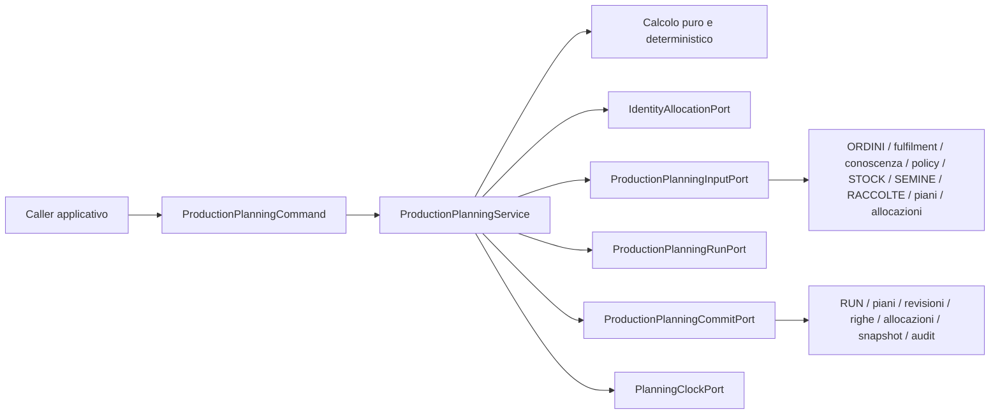

# Production Planning Engine Application Freeze V1

**Stato:** READY FOR REVIEW

## 1. Autorità e perimetro

Questo documento congela esclusivamente il contratto applicativo provider-neutral del Production Planning Engine V1. È subordinato a:

- `PRODUCTION_PLANNING_ENGINE_FREEZE.md`;
- `PRODUCTION_PLANNING_POSTGRESQL_PHYSICAL_SCHEMA_FREEZE.md`;
- `POSTGRESQL_PHYSICAL_SCHEMA.md`;
- `ORDINI.md`;
- `STOCK.md`.

Non introduce authority, schema persistente, enum, API, UI o writer ulteriori. I nomi PostgreSQL sono richiamati soltanto per rendere verificabile la corrispondenza con le authority già congelate. Google Sheets e il Write Plan legacy non appartengono al runtime autorevole.

Il motore:

- legge domanda commerciale residua, conoscenza produttiva approvata, policy, STOCK, SEMINE, RACCOLTE, piani e allocazioni;
- calcola un piano deterministico e completo;
- persiste RUN, piano, revisione, righe, risorse, allocazioni, snapshot di ripianificazione, messaggi e audit mediante i writer già congelati;
- non modifica ORDINI, RIGHE_ORDINE, CONSEGNE, STOCK, SEMINE, RACCOLTE o MOVIMENTI_MAGAZZINO;
- non trasforma una previsione in fatto fisico.

## 2. Command pubblico provider-neutral

Il solo ingresso pubblico è il valore immutabile `ProductionPlanningCommand`, una somma chiusa di due forme strutturali, non un nuovo enum:

```text
ProductionPlanningCommand =
    InitialProductionPlanningCommand
    | ReplanProductionPlanningCommand
```

### 2.1 InitialProductionPlanningCommand

| Campo | Contratto |
|---|---|
| `business_at` | istante timezone-aware che congela la vista temporale e la policy applicabile |
| `policy_set_code` | codice non vuoto del Planning Policy Set già commissionato |
| `policy_version` | versione positiva richiesta; nessuna selezione implicita della “più recente” |
| `actor_id` | actor esplicito, non vuoto |
| `reason` | motivazione esplicita, non vuota e sanitizzabile |
| `correlation_id` | correlazione esplicita, non vuota, non usata nell’idempotency hash |

### 2.2 ReplanProductionPlanningCommand

Contiene tutti i campi del command iniziale e inoltre:

| Campo | Contratto |
|---|---|
| `previous_revision_public_id` | revisione corrente completa da sostituire |
| `order_line_public_id` | RIGA_ORDINE che causa la richiesta |
| `replanning_reason_code` | uno dei valori del frozen `replanning_reason_code`; nessun valore applicativo aggiuntivo |

Il command non contiene PK PostgreSQL, nomi tabella, Connection, transaction, SQL, payload Google, ID generati dal provider o dati produttivi copiati dal caller. Non consente al caller di dichiarare quantità consegnata, STOCK disponibile, protocollo, date calcolate, allocazioni o outcome.

L’assenza di uno scope di domanda nel command è intenzionale: l’insieme eleggibile è letto dall’authority nel `business_at`, non scelto dal caller. Gli identificativi pubblici necessari alla RUN e al piano sono allocati dall’applicazione mediante la Identity già esistente.

## 3. Input contract

### 3.1 Regole generali

Tutti gli input letti dalle port sono snapshot immutabili, provider-neutral e ordinati deterministicamente. Quantità e coefficienti usano decimali esatti; mai binary floating point. Gli istanti sono timezone-aware; le date restano date. Le unità non sono convertite implicitamente. Ogni aggregate mutabile porta la propria optimistic version.

Gli snapshot non sono nuove authority: sono rappresentazioni applicative temporanee delle authority congelate.

### 3.2 PlanningInputSnapshot

`PlanningInputSnapshot` contiene:

- policy esatta richiesta;
- tutte le domande eleggibili;
- protocolli/versioni approvati candidati;
- disponibilità STOCK eleggibile;
- produzione in corso eleggibile da SEMINE;
- RACCOLTE effettive eleggibili;
- allocazioni materialmente rilevanti;
- piani e revisioni correnti materialmente rilevanti;
- per il replanning, lo snapshot canonico completo richiesto dal Freeze.

Ogni lettura è riferita allo stesso `business_at`. Il provider deve impedire una composizione silenziosa di snapshot provenienti da istanti logici diversi.

### 3.3 DemandSnapshot

Per ogni RIGA_ORDINE eleggibile:

- public ID ORDINE e RIGA_ORDINE;
- versioni ORDINE e RIGA_ORDINE;
- stato ORDINE;
- VARIETÀ e UOM;
- quantità ordinata;
- quantità netta consegnata derivata esclusivamente dalle RIGHE_CONSEGNA di CONSEGNE `CONSEGNATA`;
- domanda residua commerciale;
- data ORDINE, data prevista disponibile e priorità commerciale congelata;
- provenance necessaria già presente nell’authority.

Sono eleggibili soltanto ORDINI `APERTO` o `PARZIALMENTE_EVASO` con residuo positivo. `PROGRAMMATA`, `IN_PREPARAZIONE` e `ANNULLATA` contribuiscono zero al consegnato. STOCK, RACCOLTE, MOVIMENTI_MAGAZZINO, audit e allocazioni non sono fonti alternative del fulfilment.

### 3.4 ProductionKnowledgeSnapshot

Per ogni protocollo candidato:

- public ID e versioni strutturali;
- VARIETÀ;
- `approval_state`, con esclusivamente i valori già congelati `BOZZA`,
  `APPROVATA`, `RITIRATA`;
- intervallo di validità;
- durata fasi, resa, granularità, quantità seme e altre risorse congelate;
- readiness e dati necessari al backplanning.

Il motore usa una sola versione approvata, completa e valida. Assenza, ambiguità, sovrapposizione o incompletezza sono fail-closed; `contenuto` legacy non è authority Planning.

Lo snapshot rappresenta fedelmente anche versioni `BOZZA` e `RITIRATA`; il
modello non le filtra. La selezione delle sole versioni `APPROVATA` appartiene al
Planning Engine.

### 3.5 PlanningPolicySnapshot

Contiene l’esatta Policy Set Version richiesta e i soli parametri già congelati: timezone, cutoff, buffer temporali, quantitative buffer policy, granularità, readiness e regole di priorità. La versione deve essere valida al `business_at`; nessun default applicativo sostituisce un dato mancante.

### 3.6 Resource snapshots

`StockResourceSnapshot` contiene public ID risorsa/VARIETÀ, quantità disponibile, UOM, quantità già allocata materialmente rilevante, readiness e version. Lo STOCK resta fotografia corrente: leggere o allocare non ne modifica la quantità.

`InProgressResourceSnapshot` contiene public ID SEMINA, VARIETÀ, protocol version, finestra produttiva, quantità eleggibile, quantità già allocata e semina version.

`HarvestResourceSnapshot` contiene il fatto RACCOLTA effettivo, la quantità eleggibile e la provenance già congelata. Una previsione di raccolta non può essere trattata come fatto RACCOLTA.

`ActiveAllocationSnapshot` contiene public ID, frozen `allocation_type`, source
public ID, destination order-line public ID, UOM, `allocated_quantity`,
`consumed_quantity`, `released_quantity`, `transferred_quantity`,
`invalidated_quantity`, `remaining_quantity`, frozen state e version. Il saldo
è derivato dai fatti append-only; il modello non introduce una seconda authority.

### 3.7 ReplanningInputSnapshot

Il replanning include, nell’ordine e nel framing canonico congelati:

- revisione precedente e RIGA_ORDINE;
- reason code;
- quantità ordinata, consegnata e residua;
- versioni autorevoli;
- protocollo e validità;
- Planning Policy Set Version;
- buffer e dati temporali congelati;
- STOCK materialmente rilevante, ordinato deterministicamente;
- SEMINE materialmente rilevanti, ordinate deterministicamente;
- allocazioni materialmente rilevanti, ordinate per allocation public ID, con
  allocated, consumed, released, transferred, invalidated, remaining, stato e
  versione derivati dai fatti autorevoli;
- ogni altro elemento esplicitamente incluso dal canonical encoding frozen.

RUN, timestamp tecnico, caller, actor e correlation ID non entrano nella chiave di replanning.
Il canonical encoding include tutti i saldi sopra elencati, con Decimal
canonici e framing deterministico; non ricostruisce saldi da uno stato terminale.

## 4. Output contract

Il successo restituisce l’immutabile `ProductionPlanningResult`:

| Campo | Contratto |
|---|---|
| `planning_run_public_id` | public ID `RPP-*` |
| `run_state` | valore frozen `COMMITTED` |
| `plan_public_ids` | public ID dei piani interessati, ordinati |
| `current_revision_public_ids` | revisioni complete risultanti, nello stesso ordine dei piani |
| `revision_results` | una `RevisionCommitResult` per ogni revisione risultante, ordinata per plan public ID e revision public ID |
| `planning_line_public_ids` | righe prodotte, ordinate secondo il risultato deterministico |
| `allocation_public_ids` | allocazioni create, ordinate |
| `committed_at` | istante di conclusione autorevole |
| `warnings` | messaggi provider-neutral sanitizzati e ordinati |

`RevisionCommitResult` associa univocamente `plan_public_id`, `revision_public_id`,
`revision_request_key`, una e una sola fra `planning_key_v1` e
`replanning_key_v1`, e `reused_existing_revision`. La forma initial/replanning è
strutturale e non introduce un enum. `revision_request_key` coincide con la
chiave strutturale applicabile. I campi singoli globali `planning_key_v1`,
`replanning_key_v1` e `reused_existing_revision` non appartengono più a
`ProductionPlanningResult`.

Un replay idempotente viene valutato per ogni `revision_request_key`: ogni
revisione compatibile può essere riusata, conservando nel risultato la propria
associazione piano/revisione/chiave e il proprio indicatore di riuso. Un mismatch
materiale resta un conflitto e nessuna revisione rappresenta arbitrariamente
l'intero commit. Il replay non crea una nuova revisione e non promette il riuso
del public ID di una RUN nuova aperta per osservarlo.

Le failure certe sono espresse tramite `ProductionPlanningError` e una categoria frozen. Un esito fisico non determinabile è espresso come risultato di riconciliazione con `run_state = RECONCILIATION_REQUIRED`, public ID RUN e informazioni diagnostiche sanitizzate; non viene dichiarato rollback certo.

L’output non espone PK, SQLSTATE, SQL, stack trace, DSN, secret, dettagli driver o nomi fisici.

## 5. Application models

I modelli applicativi obbligatori sono:

- `ProductionPlanningCommand`, con le due forme strutturali definite al §2;
- `PlanningExecutionContext`: actor, reason e correlation ID espliciti;
- `PolicyVersionReference`: set code e versione;
- `PlanningInputSnapshot` e gli snapshot del §3;
- `CanonicalPlanningRequest`: valori normalizzati e ordinati destinati a `planning_key_v1`;
- `CanonicalReplanningSnapshot`: valori e collezioni nel framing frozen destinati a `canonical_hash` e `replanning_key_v1`;
- `PlanningCandidate`: calcolo non persistito con domanda, timeline, quantità e provenance;
- `PlanRevisionDraft`: revisione completa, non un delta;
- `PlanningLineDraft`: timeline, target, quantità produttiva, stato frozen e planning key scope;
- `SeedResourceDraft`: quantità seme e UOM derivati dal protocollo;
- `AllocationDraft`: parent e child tipizzato coerente con il frozen `allocation_type`;
- `AllocationTransitionDraft`: transizione quantitativa provider-neutral già determinata;
- `RunMessage`: tipo già frozen, eventuale failure category frozen, codice, messaggio e posizione;
- `ProductionPlanningCommit`: write set completo e deterministico;
- `RevisionCommitResult`: esito idempotente univoco di una singola revisione;
- `ProductionPlanningResult`;
- `ProductionPlanningError`.

Public ID, date, istanti, quantità, unità, versioni e hash sono value object validati. I modelli non replicano entità ORM né ammettono dizionari/provider payload come contratto pubblico.

## 6. Ports richieste

### 6.1 IdentityAllocationPort

Alloca, tramite l’Identity persistente già congelata, i public ID necessari per RUN, piani, revisioni, righe, snapshot e allocazioni. Le allocazioni avvengono in transazioni brevi separate, in ordine lessicografico di sequence name, mai mentre sono detenuti business lock.

### 6.2 ProductionPlanningInputPort

Legge uno snapshot coerente e completo delle authority elencate al §3. Non filtra tramite euristiche provider-specifiche e non inventa default. Espone versioni e provenance necessarie alla revalidation.

### 6.3 ProductionPlanningRunPort

Apre la RUN `OPEN`, registra i dati frozen e la expected version; finalizza una failure certa con CAS in transazione separata; supporta la riconciliazione esclusivamente secondo il protocollo già congelato. Non completa autonomamente una RUN committed fuori dal commit autorevole.

### 6.4 ProductionPlanningCommitPort

È l’unico writer autorevole del piano. Riceve il write set completo, acquisisce i lock, rilegge e revalida le authority, applica optimistic concurrency e committa atomicamente piano, revisione, righe, risorse, allocazioni, snapshot, messaggi, audit e conclusione RUN.

Non modifica le authority di input e non esegue I/O esterno durante i lock.

### 6.5 PlanningClockPort

Fornisce soltanto istanti tecnici di apertura/completamento. `business_at` proviene dal command e non viene sostituito dal clock.

Non sono richieste port Google, API, UI, event bus, stock writer, order writer, delivery writer, semina writer o harvest writer.

### 6.6 AllocationTransitionDraft e commit

`AllocationTransitionDraft` è immutabile e contiene:

- `allocation_public_id` ed `expected_version` non negativa;
- `current_state`, obbligatoriamente `ATTIVA`, e `target_state` frozen;
- `consumed_quantity_delta`, `released_quantity_delta`,
  `transferred_quantity_delta`, `invalidated_quantity_delta`, Decimal esatti
  nella UOM osservata;
- `replacement_allocation_public_id`, obbligatorio esclusivamente quando il
  delta trasferito è positivo;
- `reason` e `provenance` non vuoti e sanitizzati.

Almeno un delta è positivo, nessun delta è negativo e release, transfer e
invalidation sono mutuamente esclusivi. Il target deve essere la conseguenza
esplicita dei saldi risultanti: `ATTIVA` se resta residuo, altrimenti
`CONSUMATA`, `RILASCIATA`, `SOSTITUITA` o `INVALIDA` secondo l'unica conclusione
ammessa. Il writer non sceglie quantità, replacement o target.

`ProductionPlanningCommit` trasporta `allocation_transitions` ordinata per
allocation public ID e univoca per parent. Nuove `AllocationDraft` e transizioni
di allocazioni esistenti restano collezioni distinte. Gli `AuditDraft` associati
contengono già before/after con stato, versione, allocated, consumed, released,
transferred, invalidated, remaining, delta, replacement, actor, reason,
correlation ID e provenance; l'adapter non inventa payload business.

`expected_version` è l'epoch idempotente del batch per il parent. Un replay
rilegge tutte le transizioni della coppia allocation/version e confronta
integralmente l'insieme canonico ordinato di tipo, quantità, replacement, reason
e provenance. Payload identico è riuso compatibile; qualunque differenza è
conflict. `ON CONFLICT DO NOTHING` non prova idempotenza.

Sotto lock per allocation public ID crescente il writer verifica stato
`ATTIVA`, expected version, fatti esistenti e residuo, valida il batch, inserisce
i fatti, aggiorna stato/audit e incrementa la versione una sola volta. Due writer
sulla stessa versione producono un solo commit; nessun retry automatico.

## 7. Service responsibilities

`ProductionPlanningService.execute(command)` deve:

1. validare forma, actor, reason, correlation, `business_at` e policy reference;
2. allocare gli ID necessari senza business lock;
3. aprire una Planning RUN distinta dalla Scheduling RUN;
4. leggere lo snapshot autorevole;
5. validare eleggibilità, UOM, quantità, policy e conoscenza;
6. calcolare domanda residua senza alterare ORDINI;
7. selezionare deterministicamente protocollo e risorse;
8. applicare priorità, backplanning, timezone, cutoff, buffer e granularità frozen;
9. produrre revisioni complete, righe, risorse seme e allocazioni tipizzate;
10. calcolare chiavi e hash con il canonical encoding frozen;
11. costruire un write set completo e deterministicamente ordinato;
12. delegare revalidation e commit atomico alla Commit Port;
13. restituire il risultato committed o idempotente;
14. dopo rollback certo, finalizzare la RUN fallita in transazione separata;
15. su esito incerto, non dedurre failure e indirizzare la RUN alla riconciliazione.

Il service non deve aggiornare stato o versioni delle authority lette, avviare SEMINE, registrare RACCOLTE, movimentare STOCK, consegnare ORDINI, eseguire retry ciechi o compensazioni.

## 8. Invarianti applicative

1. Una Planning RUN è distinta da ogni Scheduling RUN e non viene riaperta dopo la conclusione.
2. Ogni run usa una sola policy version esplicita e un solo `business_at`.
3. Soltanto domanda residua positiva di ORDINI eleggibili viene pianificata.
4. Il consegnato proviene esclusivamente dal fulfilment commerciale congelato.
5. Protocollo assente, ambiguo, non approvato, incompleto o fuori validità fallisce chiuso.
6. Date e istanti seguono timezone, cutoff e DST frozen; una data non viene sintetizzata implicitamente in timestamp.
7. Quantità, UOM, resa, granularità e buffer sono esatti e coerenti; nessuna conversione implicita.
8. Priorità e tie-break non dipendono da PK interne, ordine di lettura o query plan.
9. Una revisione è uno snapshot completo append-only; la precedente non viene riscritta.
10. Planning-key scope, revision request key e hash seguono esattamente il framing congelato.
11. Stesso input materiale produce la stessa chiave; un input materiale diverso cambia la chiave.
12. Un replay idempotente non crea una seconda revisione.
13. Ogni allocazione ha esattamente un child coerente con il frozen `allocation_type`.
14. La quantità allocata non supera domanda o risorsa eleggibile; i limiti considerano gli stati frozen pertinenti.
15. Un’allocazione logica non modifica STOCK né crea un movimento fisico.
16. Le previsioni non diventano SEMINE, RACCOLTE o CONSEGNE reali.
17. Nessuna riga AVVIATA o SODDISFATTA viene riscritta retroattivamente.
18. Commit e audit sono atomici; nessun piano parziale sopravvive a rollback certo.
19. La Commit Port è l’unico writer autorevole del piano.
20. Nessun I/O esterno avviene sotto business lock.
21. Un conflitto non produce retry automatico.
22. L’esito incerto non viene classificato come rollback certo.
23. Messaggi e diagnostica sono ordinati, sanitizzati e privi di secret.
24. Google non è source, writer, fallback o destinazione dual-write.

## 9. Error taxonomy

`ProductionPlanningError.category` usa esclusivamente `planning_failure_category` già congelato:

| Categoria | Condizione applicativa | Effetto |
|---|---|---|
| `PLANNING_INPUT_INVALID` | command o input autorevole non eleggibile/incoerente | rollback certo; RUN `FAILED` |
| `PRODUCTION_KNOWLEDGE_INVALID` | protocollo assente, ambiguo, incompleto, non approvato o fuori validità | rollback certo; RUN `FAILED` |
| `PLANNING_INFEASIBLE` | deadline, granularità, disponibilità o capacità non consentono un piano valido | rollback certo; RUN `FAILED` |
| `ALLOCATION_CONFLICT` | domanda o risorsa risulta sovra-allocata o incompatibile | rollback certo; RUN `FAILED` |
| `CONCURRENCY_CONFLICT` | version mismatch o input mutato sotto lock | rollback certo; RUN `FAILED` |
| `COMMIT_FAILED_ROLLED_BACK` | failure tecnica con rollback fisico certo | nessun piano parziale; failure-finalization separata |
| `RECONCILIATION_REQUIRED` | esito fisico del commit non determinabile | nessuna deduzione; procedura di riconciliazione |
| `INTERNAL_ERROR` | difetto non riconducibile a una categoria nota | rollback se certo; diagnostica sanitizzata |

Le categorie note non vengono degradate a `INTERNAL_ERROR`. `PROTOCOL_NOT_AVAILABLE` e `PROTOCOL_AMBIGUOUS` restano codici diagnostici provider-neutral già contemplati; i codici non costituiscono una nuova tassonomia di authority. SQLSTATE e classi driver sono tradotti al boundary infrastrutturale.

## 10. Dependency graph



Le dipendenze puntano dall’infrastruttura verso application models e port. Il service non dipende da SQLAlchemy, Psycopg, Alembic, PostgreSQL, framework web o Google SDK.

## 11. Transaction boundary

### 11.1 Apertura RUN

Una transazione breve alloca/risolve il public ID e apre la RUN `OPEN`. Il piano non viene scritto in questa transazione. Una failure successiva non invalida ORDINI o fatti già committed.

### 11.2 Lettura e calcolo

La lettura e il calcolo non mantengono business lock durante CPU work o I/O esterno. Lo snapshot porta tutte le versioni necessarie alla revalidation.

### 11.3 Commit autorevole

Una sola transazione breve:

1. acquisisce il lock sulla RUN per PK;
2. acquisisce ORDINI per public ID crescente;
3. acquisisce RIGHE_ORDINE per public ID crescente;
4. acquisisce risorse STOCK/VARIETÀ per public ID crescente;
5. acquisisce SEMINE per public ID crescente;
6. acquisisce RACCOLTE per public ID crescente quando richiesto dal Freeze;
7. acquisisce piani e revisioni correnti in ordine deterministico;
8. acquisisce parent allocazione per public ID crescente;
9. acquisisce child nell’ordine frozen `DOMANDA`, `STOCK`, `PRODUZIONE_IN_CORSO`, `RACCOLTA`, quindi public ID;
10. acquisisce le altre righe Planning già esistenti in ordine deterministico;
11. rilegge stato, fulfilment, versioni, quantità e unicità;
12. persiste l’intero write set, audit e completamento RUN;
13. forza la verifica dei constraint deferred prima del commit quando necessario;
14. committa una volta.

La riga consegnata viene ricalcolata sotto i lock ORDINE/RIGA_ORDINE concordati con il Delivery Fulfilment Writer; non viene introdotto un lock order concorrente alternativo. Non esistono persistenze parziali o compensazioni automatiche.

### 11.4 Failure-finalization e incertezza

Dopo rollback fisicamente certo, una transazione distinta porta con CAS la RUN ancora `OPEN` a `FAILED`, persiste messaggi ordinati e audit, e non crea piano o allocazioni. Se il commit potrebbe essere avvenuto, questa transazione non viene eseguita deduttivamente: si applica `RECONCILIATION_REQUIRED` secondo l’autorità congelata.

## 12. Optimistic concurrency requirements

- Il command non può disabilitare la concorrenza e non sceglie le expected version.
- Lo snapshot conserva le versioni osservate di RUN, ORDINI, RIGHE_ORDINE, STOCK, SEMINE, piani, revisioni, righe Planning e allocazioni.
- Il commit confronta ogni expected version sotto il lock autorevole prima di scrivere.
- Il fulfilment commerciale e la domanda residua sono ricalcolati sotto i lock condivisi con il Delivery Fulfilment Writer.
- Le RACCOLTE immutabili sono verificate per identità e contenuto materialmente rilevante; non viene inventata una version se l’authority non la possiede.
- Un mismatch, una risorsa non più eleggibile, un ORDINE `EVASO`/`ANNULLATO`, un residuo mutato, una policy/protocollo non più valido o una revisione corrente cambiata produce rollback completo.
- Un uniqueness race sulla chiave idempotente viene risolta rileggendo il risultato committed compatibile; non è un invito a sovrascrivere.
- Un conflitto materiale incompatibile è `CONCURRENCY_CONFLICT` o `ALLOCATION_CONFLICT` secondo la causa frozen.
- Nessun retry automatico, loop CAS illimitato o advisory lock globale è ammesso.
- La failure-finalization usa RUN `OPEN` ed expected version coincidente; non può sovrascrivere una conclusione concorrente.

## 13. Test matrix completa

### 13.1 Command e modelli

| ID | Livello | Caso | Atteso |
|---|---|---|---|
| C01 | unit | command iniziale valido | accettato senza dettagli provider |
| C02 | unit | command replanning valido | precedente, riga e reason obbligatori |
| C03 | unit | actor/reason/correlation vuoto | `PLANNING_INPUT_INVALID` |
| C04 | unit | `business_at` naive | `PLANNING_INPUT_INVALID` |
| C05 | unit | policy version non positiva | `PLANNING_INPUT_INVALID` |
| C06 | unit | campi replanning parziali | rifiuto fail-closed |
| C07 | unit | Decimal/UOM/date/instant validi | nessuna perdita di precisione o sintesi temporale |
| C08 | architecture | import graph application | nessuna dipendenza SQLAlchemy/Psycopg/Alembic/web/Google |

### 13.2 Input e authority

| ID | Livello | Caso | Atteso |
|---|---|---|---|
| I01 | unit/integration | ORDINE `APERTO`, residuo positivo | eleggibile |
| I02 | unit/integration | `PARZIALMENTE_EVASO`, residuo positivo | eleggibile per il solo residuo |
| I03 | unit/integration | `EVASO` o `ANNULLATO` | escluso/failure coerente |
| I04 | integration | consegne non `CONSEGNATA` | contributo zero |
| I05 | integration | consegna e rettifica signed | residuo netto corretto |
| I06 | unit | STOCK/RACCOLTA/allocazione proposti come fulfilment | rifiutati come authority alternativa |
| I07 | unit | quantità negativa, overdelivery o UOM incoerente | `PLANNING_INPUT_INVALID` |
| I08 | integration | snapshot formato da letture incoerenti | nessun commit |
| I09 | unit | assenza priorità commerciale | ammessa, tie-break frozen |

### 13.3 Conoscenza e policy

| ID | Livello | Caso | Atteso |
|---|---|---|---|
| K01 | unit | unica versione approvata e valida | selezionata |
| K02 | unit | nessun protocollo | `PRODUCTION_KNOWLEDGE_INVALID` / `PROTOCOL_NOT_AVAILABLE` |
| K03 | unit | protocolli validi ambigui | `PRODUCTION_KNOWLEDGE_INVALID` / `PROTOCOL_AMBIGUOUS` |
| K04 | unit | BOZZA/RITIRATA/fuori validità | mai selezionata |
| K05 | unit | protocollo incompleto | failure fail-closed |
| K06 | unit | policy esatta valida | applicata |
| K07 | unit | policy mancante/fuori validità | failure senza default |
| K08 | unit | `contenuto` legacy differente | non influenza il calcolo autorevole |

### 13.4 Calcolo temporale e quantitativo

| ID | Livello | Caso | Atteso |
|---|---|---|---|
| T01 | unit | acceptance scenario frozen | timeline e quantità esatte |
| T02 | unit | backplanning ordinario | fase e harvest target coerenti |
| T03 | unit | cutoff prima/dopo soglia | date frozen corrette |
| T04 | unit | transizione DST avanti/indietro | istanti deterministici, nessun naive datetime |
| T05 | unit | deadline impossibile | `PLANNING_INFEASIBLE` |
| T06 | unit | buffer temporale | applicato una volta nel punto frozen |
| T07 | unit | quantitative policy `NONE` | nessun buffer quantitativo |
| T08 | unit | `PERCENTAGE` | Decimal e arrotondamento frozen |
| T09 | unit | `ABSOLUTE_SET` | quantità aggiuntiva e UOM coerenti |
| T10 | unit | resa/granularità esatta | quantità produttiva e set coerenti |
| T11 | unit | granularità senza copertura | `PLANNING_INFEASIBLE` |
| T12 | unit | seed resource | derivata da `grammi_seme_per_set` e protocollo |
| T13 | unit | input materialmente uguali in ordine diverso | risultato e hash identici |
| T14 | unit | tie commerciale | ordine deterministico indipendente da PK/query order |

### 13.5 Risorse e allocazioni

| ID | Livello | Caso | Atteso |
|---|---|---|---|
| A01 | unit | copertura da STOCK eleggibile | allocation `STOCK`, STOCK invariato |
| A02 | unit | copertura da SEMINA in corso | allocation `PRODUZIONE_IN_CORSO` |
| A03 | unit | copertura da RACCOLTA reale | allocation `RACCOLTA` |
| A04 | unit | domanda verso riga piano | allocation `DOMANDA` coerente |
| A05 | unit/integration | quantità allocata oltre domanda | `ALLOCATION_CONFLICT` |
| A06 | unit/integration | quantità oltre disponibilità | `ALLOCATION_CONFLICT` |
| A07 | PostgreSQL | parent senza child/più child/child errato | constraint deferred rifiuta |
| A08 | PostgreSQL | parent con esattamente un child tipizzato | commit ammesso |
| A09 | unit | lifecycle quantitativo | limite calcolato da consumed + remaining; quote disposte escluse |
| A10 | unit | previsione usata come fatto fisico | rifiutata |
| A11 | integration | pianificazione completa | nessuna modifica a STOCK/MOVIMENTI/SEMINE/RACCOLTE |

### 13.6 Idempotenza e replanning

| ID | Livello | Caso | Atteso |
|---|---|---|---|
| R01 | unit | canonical planning framing frozen | hash SHA-256 atteso |
| R02 | unit | canonical replanning framing frozen | hash e key attesi |
| R03 | unit | RUN/actor/correlation/timestamp tecnico diversi | replanning key invariata |
| R04 | unit | input materiale cambia | replanning key cambia |
| R05 | integration | replay stessa request key | stessa revisione, nessun duplicato |
| R06 | integration | race sulla stessa key | un solo risultato committed |
| R07 | unit/integration | replanning | nuova revisione completa con precedente |
| R08 | integration | prima revisione con reason/snapshot | rifiutata |
| R09 | integration | revisione successiva senza reason/snapshot | rifiutata |
| R10 | unit | active allocation snapshot ordine variabile | canonical order per public ID |
| R11 | PostgreSQL | snapshot STOCK/SEMINE/allocazioni non dense | constraint deferred rifiuta |
| R12 | unit/integration | riga AVVIATA/SODDISFATTA | fatti storici non riscritti |

### 13.7 Transazioni e concorrenza

| ID | Livello | Caso | Atteso |
|---|---|---|---|
| X01 | integration | apertura RUN | transazione distinta, RUN `OPEN` |
| X02 | PostgreSQL | commit valido | unico commit atomico, RUN `COMMITTED` |
| X03 | fault injection | failure prima del commit | rollback totale |
| X04 | fault injection | failure dopo rollback certo | failure-finalization separata a `FAILED` |
| X05 | fault injection | esito commit incerto | `RECONCILIATION_REQUIRED`, nessuna deduzione |
| X06 | PostgreSQL | order version cambia | `CONCURRENCY_CONFLICT`, zero write parziali |
| X07 | PostgreSQL | order-line fulfilment cambia | residuo ricalcolato, conflitto |
| X08 | PostgreSQL | STOCK version/quantità cambia | conflitto/allocation conflict |
| X09 | PostgreSQL | SEMINA version/eleggibilità cambia | conflitto |
| X10 | PostgreSQL | revisione corrente cambia | conflitto, nessuna sostituzione persa |
| X11 | PostgreSQL | allocazione concorrente cambia | conflitto, nessuna sovra-allocazione |
| X12 | PostgreSQL | failure constraint deferred | rollback di piano, allocazioni, audit e RUN completion |
| X13 | concurrency | due writer con lock order frozen | nessun deadlock sistematico |
| X14 | unit/integration | I/O esterno durante lock | impossibile per contratto/spy |
| X15 | integration | conflitto transitorio | nessun retry automatico |
| X16 | integration | failure-finalizer con RUN già conclusa/version diversa | CAS rifiuta |
| X17 | integration | Identity allocation | transazioni separate, sequence order, nessun business lock |

### 13.8 Lifecycle, audit e confini

| ID | Livello | Caso | Atteso |
|---|---|---|---|
| B01 | integration | successo | contatori, messaggi e audit ordinati |
| B02 | integration | rollback | nessun audit/piano parziale |
| B03 | integration | messaggio con dettaglio sensibile | sanitizzato |
| B04 | architecture | service ports | nessun writer ORDINI/STOCK/CONSEGNE/SEMINE/RACCOLTE |
| B05 | architecture | runtime dependency scan | nessun Google source/writer/fallback/dual-write |
| B06 | integration | planning da ORDINE committed, poi failure | ORDINE resta valido e invariato |
| B07 | integration | allocation STOCK | quantità fisica e movimenti invariati |
| B08 | integration | calendario | sola proiezione delle authority già congelate |
| B09 | contract | output/error serialization provider-neutral | nessuna PK, SQLSTATE, DSN, SQL o stack trace |
| B10 | acceptance | scenario obbligatorio end-to-end su PostgreSQL reale | RUN, piano, revisione, allocazioni, audit e re-read coerenti |

### 13.9 Obblighi della suite

La suite deve combinare:

- unit test puri per command, modelli, canonical encoding, priorità, quantità e timeline;
- contract test identici per ogni implementazione delle port;
- integration test su PostgreSQL reale effimero per transaction boundary, CAS, lock, uniqueness, constraint deferred e rollback;
- fault injection prima del commit, durante il commit e dopo outcome incerto;
- concurrency test con connessioni indipendenti e timeout espliciti;
- architecture test per impedire dipendenze provider e writer vietati;
- acceptance test frozen completo, senza database operativo, secret o dati business reali.

Ogni test negativo deve verificare categoria, RUN finale, assenza di write parziali e riutilizzabilità della connessione. Skip del PostgreSQL reale non equivale a validazione GREEN.

APPLICATION FREEZE READY FOR REVIEW
